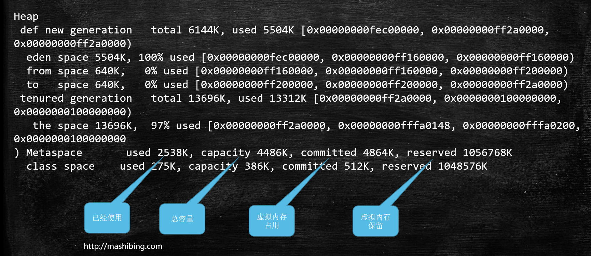
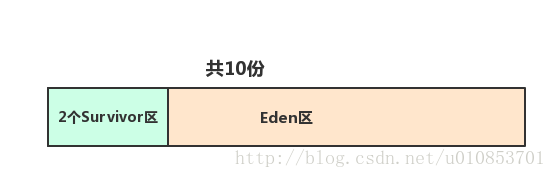
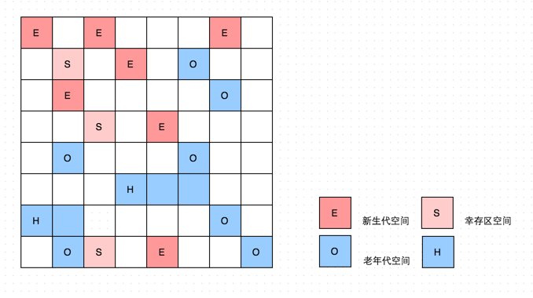
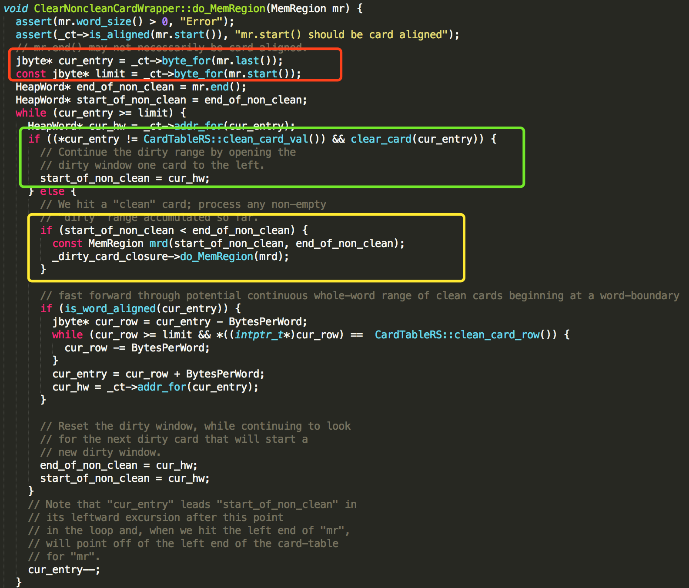

# GC与内存分配策略

> 排查各种内存溢出、内存泄漏问题时，要进行对垃圾收集器进行监控和调整。
>


## GC概念


-Xms 堆内存的最小大小，默认为物理内存的1/64

-Xmx 堆内存的最大大小，默认为物理内存的1/4

-Xmn 堆内新生代的大小。通过这个值也可以得到老生代的大小：-Xmx减去-Xmn

-Xss 设置每个线程可使用的内存大小，即栈的大小。


### GC日志详情

#### 常用

> * java -Xmx4000M -Xms4000M -Xmn600M -XXmSize500M -XX:MaxPermSize500M -Xss256K -XX:+DisableExplicitGC -XX:SurvivorRatio=1 -XX:+UseConcMarkSweepGC -XX:+UseParNewGC -XX:+CMSParallelRemarkEnabled eCMSCompactAtFullCollection -XX:CMSFullGCsBeforeCompaction=0 -XX:+CMSClassUnloadingEnabled -XX:LargePageSizeInBytes=128M -XX:+UseFastAccessorMethods -XX:+UseCMSInitiatingOccupancyOnly -XX:CMSInitiatingOccupancyFraction=80 -XX:SoftRefLRUPolicyMSPerMB=0 -XX:+PrintClassHistogram -XX:+PrintGCDetails -XX:+PrintGCTimeStamps -XX:+PrintHeapAtGC -Xloggc:log/gc.log T01_HelloGC
> * java -XX:+UseConcMarkSweepGC -XX:+PrintCommandLineFlags -XX:+PrintGCDetails T01_HelloGC
> * java -Xms50M -Xmx50M -XX:+PrintGC com.zhenksoft.architect.jvm.c5_gc.T15_FullGC_Problem01


输入参数`` -XX:+PrintGCDetails``打印GC日志


每种垃圾回收器的日志格式是不同的！

PS日志格式


heap dump部分：

```java
eden space 5632K, 94% used [0x00000000ff980000,0x00000000ffeb3e28,0x00000000fff00000)
                            后面的内存地址指的是，起始地址，使用空间结束地址，整体空间结束地址
```



total = eden + 1个survivor

Eden:Survivor0:Survivor1=8:1:1

Y:O=(1/3):(2/3)


#### JVM日志监测

* **jconsole远程连接**

> 1. 程序启动之前加参数
>
> ```shell
> java -Djava.rmi.server.hostname=192.168.10.150 -Dcom.sun.management.jmxremote -Dcom.sun.management.jmxremote.port=11111 -Dcom.sun.management.jmxremote.authenticate=false -Dcom.sun.management.jmxremote.ssl=false -XX:+PrintGC -Xms200M -Xmx200M T15_FullGC_Problem01
> ```
>
> 2. 如果遭遇 Local host name unknown：XXX的错误，修改/etc/hosts文件，把XXX加入进去
>
> > ```java
> > 192.168.10.150 basic localhost localhost.localdomain localhost4 localhost4.localdomain4
> > ::1         localhost localhost.localdomain localhost6 localhost6.localdomain6
> > ```
>
> 3. 关闭linux防火墙（实战中应该打开对应端口）
>
> > ```shell
> > service iptables stop
> > chkconfig iptables off #永久关闭
> > ```
>
> 4. windows上打开 jconsole远程连接 192.168.10.150:11111


* jmap -histo 4655 | head -20，查找有多少对象产生

* jmap -dump:format=b,file=xxx pid：导出堆

  > 例子:jmap -dump:live,file=a.log pid

* java -Xms20M -Xmx20M -XX:+UseParallelGC -XX:+HeapDumpOnOutOfMemoryError com.mashibing.jvm.gc.T15_FullGC_Problem01

  > 虚拟机启动时如果指定了 -XX:+HeapDumpOnOutOfMemoryError 选项, 则在抛出 OutOfMemoryError 时, 会自动执行堆转储

* top/jps 查看线程PID 

* ``top -Hp 上面查找到的PID``：监控线程PID对应包含的进程

* ``jinfo pid``：查看进程中的详细配置信息

* jhat：用来分析java堆的命令，可以将堆中的对象以html的形式显示出来，包括对象的数量，大小等等，并支持**对象查询语言**。

  > \#jhat -J-Xmx512M a1.log
  >
  > 说明：有时dump出来的堆很大，在启动时会报堆空间不足的错误，可加参数中的512M表示的堆大小。
  >
  > 执行这个jhat命令后，解析Java堆转储文件,并启动一个 web server

* jstat -gc 4655 500 : 每个500个毫秒打印GC的情况

> [root@base ~]# jstat -gc 4798 500
>  S0C    S1C    S0U    S1U      EC       EU        OC         OU       MC     MU    CCSC   CCSU   YGC     YGCT    FGC    FGCT     GCT   
> 6784.0 6784.0  0.0   6784.0 54656.0  54656.0   136576.0   136576.0  9600.0 9013.6 1152.0 1018.1      9    0.603 5438  3217.791 3218.393

* **arthas**

  > ``jvm``：相当于java命令中的``jinfo pid``查看jvm详细信息
  >
  > ``thread``：定位线程问题，相当``top``
  >
  > ``thread id``：相当``top -Hp id``
  >
  > ``dashboard``：相当jmap 
  >
  > headump + jhat分析
  >
  > ``redefine``：热替换class类


### 常用配置

```shell
#查看
java -XX:+PrintFlagsFinal -version | grep NewRatio

java -XX:+UnlockDiagnosticVMOptions -XX:+PrintFlagsFinal -version | egrep  "Threshold|Percent|Ratio"

-XX:+PrintAdaptiveSizePolicy

-Xms512m  设置JVM促使内存为512m。此值可以设置与-Xmx相同，以避免每次垃圾回收完成后JVM重新分配内存。
-Xmx512m ，设置JVM最大可用内存为512M。
-Xmn200m：设置年轻代大小为200M。整个堆大小=年轻代大小 + 年老代大小 + 持久代大小。持久代一般固定大小为64m，所以增大年轻代后，将会减小年老代大小。此值对系统性能影响较大，Sun官方推荐配置为整个堆的3/8。
-Xss128k：
设置每个线程的堆栈大小。JDK5.0以后每个线程堆栈大小为1M，以前每个线程堆栈大小为256K。更具应用的线程所需内存大小进行调整。在相同物理内存下，减小这个值能生成更多的线程。但是操作系统对一个进程内的线程数还是有限制的，不能无限生成，经验值在3000~5000左右。
-Xloggc:file
 与-verbose:gc功能类似，只是将每次GC事件的相关情况记录到一个文件中，文件的位置最好在本地，以避免网络的潜在问题。
 若与verbose命令同时出现在命令行中，则以-Xloggc为准。
-Xprof
 跟踪正运行的程序，并将跟踪数据在标准输出输出；适合于开发环境调试。
```


``-XX:NewRatio``

- 新生代（Eden + 2*S）与老年代（不包括永久区）的比值
  - 要求比较的搞得吞吐量（避免较多的fullGC）
- 4 表示新生代 ：老年代 = 1：4 ，意思是老年代占 4/5   


``-XX:SurvivorRatio``

- 2个Survivor区和Eden区的比值
- 8 表示 两个Survivor ： Eden = 2： 8 ，每个Survivor占 1/10   



### 常用GC组合参数设定

```shell
-XX:+UseSerialGC is "Serial" + "Serial Old":
-XX:+UseParNewGC is "ParNew" + "Serial Old"
-XX:+UseConcMarkSweepGC is "ParNew" + "CMS" + "Serial Old".
-XX:+UseParallelGC is "Parallel Scavenge" + "Serial Old"(1.8默认垃圾回收器)
-XX:+UseParallelOldGC is "Parallel Scavenge" + "Parallel Old"
```


| Collector | Multiple GC Threads | STW (Young Generation) | STW (Old Generation) | Heap Compaction | Primary Goal |
| --------- | ------------------- | ---------------------- | -------------------- | --------------- | ------------ |
| Serial    | no                  | yes                    | yes                  | yes             | -            |
| Parallel  | yes                 | yes                    | yes                  | yes             | throughput   |
| CMS       | yes                 | yes                    | only during scan     | no              | latency      |
| G1        | yes                 | yes                    | very short ones      | partially       | latency      |

| **Young**             | **Tenured/Old**  | **JVM options**                              |
| --------------------- | ---------------- | -------------------------------------------- |
| Incremental           | Incremental      | -Xincgc                                      |
| **Serial**            | **Serial**       | **-XX:+UseSerialGC**                         |
| Parallel Scavenge     | Serial           | -XX:+UseParallelGC -XX:-UseParallelOldGC     |
| Parallel New          | Serial           | N/A                                          |
| Serial                | Parallel Old     | N/A                                          |
| **Parallel Scavenge** | **Parallel Old** | **-XX:+UseParallelGC -XX:+UseParallelOldGC** |
| Parallel New          | Parallel Old     | N/A                                          |
| Serial                | CMS              | -XX:-UseParNewGC -XX:+UseConcMarkSweepGC     |
| Parallel Scavenge     | CMS              | N/A                                          |
| **Parallel New**      | **CMS**          | **-XX:+UseParNewGC -XX:+UseConcMarkSweepGC** |
| **G1**                | **-XX:+UseG1GC** |                                              |


### Minor GC vs Major GC vs Full GC

> **Minor GC**：清理年轻代内存
>
> > 1. 复制活跃对象的时间
> > 2. 扫描card table(老年代对象引用新生代对象)的时间
>
> **Major GC**：清理老年代内存
>
> **Full GC**：清理整个堆空间—包括年轻代和老年代
>
>


## 垃圾收集器

> * STW使用的时间较长。生产环境上线之前没有配置收集器的时候默认为PS+PO这两个收集器的组合。
> * 各个垃圾收集器的简介
>   * Serial+Serial Old垃圾收集器中,用来收集垃圾的显示是单线程；内存相对小
>   * Parallel Scavenge+ Parallel Old垃圾线程为多线程，为并行线程。内存相对应Serial需要的内存变大，当Serial垃圾收集器当遇到内存大的时候就会出现STW停顿时间较长，这时就需要垃多线程来回收垃圾，此时Parallel登上舞台。
>   * CMS为垃圾线程为并发线程，和用户线程一起运行。当多线程回收垃圾也会出现STW停顿时间较长，这时垃圾收集线程和用户线程并发运行
>
> 以上垃圾收集器都要事先分配YGC和OGC,在扫描的时候当遇到内存很大的时候STW停顿时间都会随着内存的变大怎么调优都会变长。
>
> Serial+Serial Old  ——>  Parallel Scavenge+ Parallel Old  ——>   CMS   ——>  G1
>
> 单线程,内存小   ——>  多线程,内存相对大  ——>  和用户线程并发执行线程,内存为更大  ——>    


> jdk1.7 默认垃圾收集器Parallel Scavenge（新生代）+Parallel Old（老年代）
>
> jdk1.8 默认垃圾收集器Parallel Scavenge（新生代）+Parallel Old（老年代）
>
> jdk1.9 默认垃圾收集器G1
>
> jdk10  默认垃圾收集器G1
>
> 使用命令查看垃圾收集器的参数:``java -XX:+PrintCommandLineFlags -version``
>
> -XX:+PrintCommandLineFlags    jvm参数可查看默认设置收集器类型
>
> -XX:+PrintGCDetails亦可通过打印的GC日志的新生代、老年代名称判断

```shell
-XX:InitialHeapSize=512985664 -XX:MaxHeapSize=8207770624 -XX:+PrintCommandLineFlags -XX:+UseCompressedClassPointers -XX:+UseCompressedOops -XX:+UseParallelGC
```


JDK1.8出现后就有了G1默认的是Parallel，并当JDK1.9出现后就默认垃圾回收器为G1


> **并行（Parallel）：指多条垃圾收集线程并行工作，但此时用户线程仍然处于等待状态**
> **并发（Concurrent）：指用户线程和垃圾收集线程同时执行（但不一定是并行的，可能是交替执行），用户程序继续运行，而垃圾收集程序运行在另外的CPU上。**

| 收集器名称        | 区域          | 说明                                                         |
| ----------------- | ------------- | ------------------------------------------------------------ |
| Serial            | 新生代        | 单线程，GC时必须停止其它线程直到收集结束；JVM运行在client模式下新生代的默认收集器，简单有效；采用复制算法 |
| ParNew            | 新生代        | Serial收集的多线程版，保留Serial的参数控制，算法等，暂停所有用户线程，采用复制算法；JVM运行在server的首先的新生代收集器；只有它能和CMS配合工作 |
| Parallel Scavenge | 新生代        | 采用复制算法，并行的多线程收集器，与ParNew不同的是，关注点不是停顿时间，而是可控制的吞吐量，即运行用户代码的时间/（运行用户代码的时间+垃圾收集的时间）。可设置最大GC时间和吞吐量大小等参数，也可以让JVM自适应调整策略 |
| G1                | 新生代/老年代 | 收集器最前沿版本，JDK 1.7，代替CMS的新产品                   |
| CMS               | 新生代        | concurrent Mark Sweep，已获取最短回收停顿为目标，大部分的互联网站及服务端采用的方式，标记-清除算法 |
| Serial Old（MSC） | 老年代        | Serial的老年版，单线程收集器，采用标记-整理算法，主要是client模式的JVM使用 |
| Parallel Old      | 老年代        | Parallel Scavenge的老年版，多线程，标记整理算法              |


### 新生代收集器

>如果年轻一代填满了，这将导致少量垃圾收集并触发*Stop the World*。尚存的物体被移到了老一代。
>
>> STW：所有应用程序线程都将*停止，*直到完成特定操作为止。
>
>在年轻一代中，存在三个区域：伊甸园，幸存者空间0和幸存者空间1。

#### Serial收集器

> Serial收集器在进行垃圾收集时,用户线程必须在一个安全点Safe Point上停止(STW)，单GC线程采用新生代复制算法进行回收垃圾。
>
> a stop-the-world,copying collector which uses a single GC thread


#### ParNew收集器

> ​     a stop-the-world, copying collector which uses multiple GC threads. 
>
> ​     It differs from "Parallel Scavenge" in that it has enhancements that make it usable with CMS. 
>
> ​     For example, "ParNew" does the synchronization needed so that it can run during the concurrent phases of CMS.


#### Parallel Scavenge收集器

> a stop-the-world,copying collector which uses multiple GC thread。


### 老年代收集器

> 老一代用于存储长期存活的对象。为了使对象成为要从年轻一代移动到老一代的候选者，设置了阈值。最终，需要收集旧的一代，此事件称为大型垃圾回收。
>
> A mayor garbage collection也是*“STW”*事件。但是，这种“STW”的速度要慢得多，因为它涉及活动对象，因此应将此类事件最小化。

#### Serial Old收集器

> a stop-the-world,mark-sweep-compact collector that uses a single GC thread


#### Parallel Old收集器

> a compacting collector that uses multiple GC thread


#### CMS收集器

> a mostly concurrent, low-pause collector（并发低停顿收集器）。
>
> 并发标记：GC线程和用户线程可以并发运行操作
>
> 使用“ CMS”来收集老年代上的垃圾。并发模式下的CMS失败时会使用“ Serial Old”来进行标量压缩其中的碎片。
>
> 使用的算法为：三色标记 + Incremental Update

##### 运行阶段

> 1. 初始标记（stop the world过程）
>    单线程，仅仅关联GC Roots能直接关联到的对象，速度很快，
>
>    GC Roots：线程栈变量，静态变量，常量池，JNI指针
>
> 2. 并发标记
>    垃圾回收线程为多线程消耗的时间最长，所以和用户线程并发， 进行GC Roots Trancing的过程
>
> 3. 重新标记 （stop the world过程）
>    多线程，为了修正并发标记期间因用户程序继续运行而导致的标记产生变动的那一部分对象，比初始标记略长，但远比并发标记短
>
> 4. 并发清除
>    多线程，和用户线程并发


CMS（Concurrent Mark Sweep）收集器是一个以获取最短停顿时间为目标的老年代收集器，基于"标记-清除"算法的并发收集器。由于现代互联网中的应用，比较重视服务的响应速度和系统的停顿时间，所以CMS收集器非常适合在这种场景下使用。运行的过程如下：

CMS收集器的运行过程相对其他收集器要复杂一些，整个收集过程分为4个阶段：

- **初始标记**(CMS initial mark)：用户线程会被停止，**标记GC Roots可以直接关联到的对象**，速度很快。（STW时间较短）
- **并发标记**(CMS concurrent mark)：**从GC Roots 出发，标记出所有可达的对象**，这个过程可能会花费相对比较长的时间，但是由于在这个阶段GC线程和用户线程是可以一起运行的，所以不会影响到系统的运行。（花费时间较长,所以用户线程和GC线程并发运行）
- **重新标记**(CMS remark)：用户线程会被停止，对并发标记期间因用户程序运行而导致标记变动的那部分记录进行修正，重新标记阶段耗时一般比初始标记稍长，但是远小于并发标记阶段。（STW时间较短）
- **并发清除**(CMS concurrent sweep)：不会停止系统的运行，所以即使相对耗时，也不会对系统运行产生大的影响。在清理过程中还会产生新的垃圾为**浮动垃圾**，等下一次CMS进行清理。

　

##### 缺点

> 为了解决下面的问题,CMS提供了**-XX:+UseCMSCompactAtFullCollection**选项，该选项告诉CMS在完全GC完成后执行内存压缩，但这会发生FGC增加GC暂停时间。(FGC---> 碎片整理)

- **对CPU资源非常敏感。**在并发阶段，由于占用一部分的线程，或者说CPU资源，导致应用程序变慢，总吞吐量降低。

- **无法处理浮动垃圾(Floating Garbage)。**并发清理阶段，由于清理线程和用户线程一起运行，如果在清理过程中，用户线程产生了垃圾对象，这些垃圾对象就成为了浮动垃圾。

  > 通过-XX:CMSInitiatingOccupancyFraction的值来调整CMS老年代回收的阈值


- **产生大量内存碎片(Memory Fragmentation)。**由于使用“标记-清除“算法，在进行垃圾清理以后，会出现很多内存碎片，过多的内存碎片会影响大对象的分配。Mark-Sweep算法开始就是应用于小内存的虚拟机，现在出现了大内存虚拟机，导致碎片化更严重，出现找不到连续空间来分配大对象。

  > -XX:+UseCMSCompactAtFullCollection
  > -XX:CMSFullGCsBeforeCompaction 默认为0 指的是经过多少次FGC才进行压缩
  >
  >


###### PromotionFailed(碎片问题)

> 会导致提前进行CMS Full GC(标记清除算法会出现碎片)，尽管CMS的**Major GC**代并没有填满
>
> * 解决方案类似，保持老年代有足够的空间
>
> * ①添加参数      -XX:UseCMSCompactAtFullCollection -XX:CMSFullGCBeforeCompaction=5
>
> **CMS在进行5次Full GC（标记清除）之后进行一次标记整理算法，从而可以控制老年代的碎片在一定的数量以内，甚至可以配置CMS在每次Full GC的时候都进行内存的整理**
>
> * ②增加Survivor空间的大小
>
> ```shell
> -Xmx4000M -Xms4000M -Xmn600M -XXmSize=500M -XX:MaxPermSize=500M -Xss256K -XX:+DisableExplicitGC -XX:SurvivorRatio=1 -XX:+UseConcMarkSweepGC -XX:+UseParNewGC -XX:+CMSParallelRemarkEnabled eCMSCompactAtFullCollection -XX:CMSFullGCsBeforeCompaction=0 -XX:+CMSClassUnloadingEnabled -XX:LargePageSizeInBytes=128M -XX:+UseFastAccessorMethods -XX:+UseCMSInitiatingOccupancyOnly -XX:CMSInitiatingOccupancyFraction=80 -XX:SoftRefLRUPolicyMSPerMB=0 -XX:+PrintClassHistogram -XX:+PrintGCDetails -XX:+PrintGCTimeStamps -XX:+PrintHeapAtGC -Xloggc:log/gc.log
> ```
>
>


> –XX:CMSInitiatingOccupancyFraction 92% 可以降低这个值，让CMS保持老年代足够的空间
>
> -XX:CMSInitiatingOccupancyFraction=70    设定CMS在对内存占用率达到70%的时候开始FGC(因为CMS会有浮动垃圾,所以一般都较早启动GC,所以相对而言要设置小点早点触发FGC);

```shell
intx CMSInitiatingOccupancyFraction         = -1           {product}
```

解释如下:如果CMSInitiatingOccupancyFraction是个负值，那么CMSTriggerRatio将被用到

```c++
  product(intx, CMSInitiatingOccupancyFraction, -1,                         \
          "Percentage CMS generation occupancy to start a CMS collection "  \
          "cycle. A negative value means that CMSTriggerRatio is used")    
```


```c++
// The field "_initiating_occupancy" represents the occupancy percentage
// at which we trigger a new collection cycle.  Unless explicitly specified
// via CMSInitiatingOccupancyFraction (argument "io" below), it
// is calculated by:
//
//   Let "f" be MinHeapFreeRatio in
//
//    _intiating_occupancy = 100-f +
//                           f * (CMSTriggerRatio/100)
//   where CMSTriggerRatio is the argument "tr" below.
//
// That is, if we assume the heap is at its desired maximum occupancy at the
// end of a collection, we let CMSTriggerRatio of the (purported) free
// space be allocated before initiating a new collection cycle.
//其中tr局部变量为CMSTriggerRatio
void ConcurrentMarkSweepGeneration::init_initiating_occupancy(intx io, uintx tr) {
  assert(io <= 100 && tr <= 100, "Check the arguments");
  if (io >= 0) {
    _initiating_occupancy = (double)io / 100.0;
  } else {
    _initiating_occupancy = ((100 - MinHeapFreeRatio) +
                             (double)(tr * MinHeapFreeRatio) / 100.0)
                            / 100.0;
  }
}

_cmsGen ->init_initiating_occupancy(CMSInitiatingOccupancyFraction, CMSTriggerRatio);
//可在cmd中输入java -XX:+PrintFlagsFinal -version | grep Ratio查看器相对应的值
//uintx CMSTriggerRatio   = 80                                  {product}
//uintx MinHeapFreeRatio  = 40                                  {manageable}

//计算公式为 ((100 - MinHeapFreeRatio) + (double)( CMSTriggerRatio * MinHeapFreeRatio) / 100.0) / 100.0 即
((100-40)+(double)(80*40)/100.0)/100.0=(60+3200/100)/100=92%
    
//最终当老年代达到 ((100 - 40) + (double) 80 * 40 / 100 ) / 100 = 92 %时，会触发CMS回收。
```


###### Concurrent Mode Failure(浮动垃圾问题)

> 解决方案：降低触发CMS的阈值，修改-XX:CMSInitiatingOccupancyFraction值


#### CMS日志分析

执行命令

> cd /zhenk/gc && java -Xms20M -Xmx20M -XX:+PrintGCDetails -XX:+UseConcMarkSweepGC T15_FullGC_Problem01


日志如下:


```shell
[root@base gc]# cd /zhenk/gc && java -Xms20M -Xmx20M -XX:+PrintGCDetails -XX:+UseConcMarkSweepGC T15_FullGC_Problem01
[GC (Allocation Failure) [ParNew: 5504K->640K(6144K), 0.0110627 secs] 5504K->1124K(19840K), 0.0111325 secs] [Times: user=0.01 sys=0.00, real=0.01 secs] 
[GC (Allocation Failure) [ParNew: 6144K->640K(6144K), 0.0144837 secs] 6628K->2750K(19840K), 0.0145301 secs] [Times: user=0.01 sys=0.00, real=0.01 secs] 
[GC (Allocation Failure) [ParNew: 6136K->640K(6144K), 0.0253461 secs] 8247K->6148K(19840K), 0.0253948 secs] [Times: user=0.02 sys=0.00, real=0.03 secs] 
[GC (Allocation Failure) [ParNew: 6144K->638K(6144K), 0.0207666 secs] 11652K->8779K(19840K), 0.0208153 secs] [Times: user=0.02 sys=0.00, real=0.02 secs] 
[GC (CMS Initial Mark) [1 CMS-initial-mark: 8140K(13696K)] 8997K(19840K), 0.0012377 secs] [Times: user=0.00 sys=0.00, real=0.00 secs] 
## 8140K(13696K)：老年代使用(最大)
## 8997K(19840K)：整个堆使用(最大)
## 调整-XX:CMSInitiatingOccupancyFraction这个参数可以当在老年代使用被占用比例时启动CMS,应该要根据情况来进行调大调小。
[CMS-concurrent-mark-start]
[CMS-concurrent-mark: 0.013/0.013 secs] [Times: user=0.01 sys=0.00, real=0.01 secs] 
[CMS-concurrent-preclean-start]
[CMS-concurrent-preclean: 0.004/0.004 secs] [Times: user=0.00 sys=0.00, real=0.01 secs] 
[GC (CMS Final Remark) [YG occupancy: 1661 K (6144 K)][Rescan (parallel) , 0.0012780 secs][weak refs processing, 0.0000174 secs][class unloading, 0.0008297 secs][scrub symbol table, 0.0006420 secs][scrub string table, 0.0001336 secs][1 CMS-remark: 8140K(13696K)] 9802K(19840K), 0.0030359 secs] [Times: user=0.00 sys=0.00, real=0.00 secs] 
[CMS-concurrent-sweep-start]
[CMS-concurrent-sweep: 0.013/0.013 secs] [Times: user=0.01 sys=0.00, real=0.01 secs] 
[CMS-concurrent-reset-start]
[CMS-concurrent-reset: 0.000/0.000 secs] [Times: user=0.00 sys=0.00, real=0.00 secs] 
[GC (CMS Initial Mark) [1 CMS-initial-mark: 8078K(13696K)] 10171K(19840K), 0.0020945 secs] [Times: user=0.01 sys=0.00, real=0.00 secs] 
[CMS-concurrent-mark-start]
[CMS-concurrent-mark: 0.021/0.021 secs] [Times: user=0.01 sys=0.00, real=0.03 secs] 
[CMS-concurrent-preclean-start]
[CMS-concurrent-preclean: 0.002/0.002 secs] [Times: user=0.00 sys=0.00, real=0.00 secs] 
[GC (CMS Final Remark) [YG occupancy: 2093 K (6144 K)][Rescan (parallel) , 0.0029122 secs][weak refs processing, 0.0000150 secs][class unloading, 0.0013447 secs][scrub symbol table, 0.0005472 secs][scrub string table, 0.0001642 secs][1 CMS-remark: 8078K(13696K)] 10171K(19840K), 0.0051107 secs] [Times: user=0.00 sys=0.00, real=0.01 secs] 
[CMS-concurrent-sweep-start]
[CMS-concurrent-sweep: 0.004/0.004 secs] [Times: user=0.01 sys=0.00, real=0.00 secs] 
[CMS-concurrent-reset-start]
[CMS-concurrent-reset: 0.000/0.000 secs] [Times: user=0.00 sys=0.00, real=0.00 secs] 
[GC (CMS Initial Mark) [1 CMS-initial-mark: 8077K(13696K)] 10602K(19840K), 0.0031134 secs] [Times: user=0.00 sys=0.00, real=0.00 secs] 
[CMS-concurrent-mark-start]
[CMS-concurrent-mark: 0.022/0.022 secs] [Times: user=0.02 sys=0.00, real=0.02 secs] 
[CMS-concurrent-preclean-start]
[CMS-concurrent-preclean: 0.008/0.008 secs] [Times: user=0.00 sys=0.00, real=0.01 secs] 
^CHeap
 par new generation   total 6144K, used 2603K [0x00000000fec00000, 0x00000000ff2a0000, 0x00000000ff2a0000)
  eden space 5504K,  47% used [0x00000000fec00000, 0x00000000fee8ae80, 0x00000000ff160000)
  from space 640K,   0% used [0x00000000ff160000, 0x00000000ff160000, 0x00000000ff200000)
  to   space 640K,   0% used [0x00000000ff200000, 0x00000000ff200000, 0x00000000ff2a0000)
 concurrent mark-sweep generation total 13696K, used 13695K [0x00000000ff2a0000, 0x0000000100000000, 0x0000000100000000)
 Metaspace       used 3863K, capacity 4648K, committed 4864K, reserved 1056768K
  class space    used 420K, capacity 455K, committed 512K, reserved 1048576K

```


#### G1收集器

>  分代是在逻辑上分代，物理方面不分代，是**服务端垃圾收集器**，则G1的内存区域不是固定的E或者O。G1中的新老年代比例是动态的,是根据内存模型的改变产生的。采用了分而治之的思想。
>
>  * The [Garbage First Garbage Collector (G1 GC)](https://www.oracle.com/technetwork/java/javase/tech/g1-intro-jsp-135488.html) is the low-pause, server-style generational garbage collector for Java HotSpot VM. The G1 GC uses concurrent and parallel phases to achieve its target pause time and to maintain good throughput. When G1 GC determines that a garbage collection is necessary, it collects the regions with the least live data first (garbage first).
>
>
>
>  * Serial GC、Parallel GC、PN+CMS等垃圾收集器操作都会扫描整个老年代，不适合大内存；Y/O都是独立的内存块，大小必须提前确定。
>
>    而G1是一种服务端应用使用的垃圾收集器，目标是用在多核、大内存的机器上，它在大多数情况下可以实现指定的GC暂停时间，同是还能保持较高的吞吐量。全堆操作（例如全局标记）与应用程序线程同时执行。这样可以防止与堆或活动数据大小成比例的中断。
>
>  * 特点：并发收集；压缩空闲时间不会延长GC的暂停时间；更易预测的GC暂停时间；适用不需要实现很高的吞吐量的场景。
>
>  * G1为了以 Region 为单位进行垃圾回收的目的，使用了[RSet](#RSet)技术，G1中每个Region都有一个与之对应的RememberSet，在各个Region上记录自家的对象被外面对象引用的情况。当进行内存回收时，在GC根节点的枚举范围中加入RememberSet即可保证不对全扫描也不会漏扫。


##### 运行阶段

> 1. 初始标记
>    单线程，仅仅关联GC Roots能直接关联到的对象，速度很快；修改TAMS（Next Top at Mark Start），为了下一阶段用户程序并发运行，能在正确可用的Region上创建对象
> 2. 并发标记
>    同CMS，并且虚拟机记录将并发标记时间对象变化记录在线程Remembered Set Logs中
> 3. 最终标记
>    同CMS，将Remembered Set Logs里面的数据合并到Remembered Set中
> 4. 筛选回收
>    标记-整理算法，Region


##### G1的内存模型

> G1按照堆进行划分:
>
> * Humongous为大对象,占用内存可能是4k,或者3k等等。
> * 一个Region的大小可以通过参数-XX:G1HeapRegionSize设定,取值范围从1M到32M，是2的指数。如果不设定，那么G1会根据Heap大小自动设定




##### 每个Region有多大

> heapRegion.hpp中调用了此``src\share\vm\gc_implementation\g1\heapRegionBounds.hpp``路径下的方法

```cpp
#ifndef SHARE_VM_GC_IMPLEMENTATION_G1_HEAPREGIONBOUNDS_HPP
#define SHARE_VM_GC_IMPLEMENTATION_G1_HEAPREGIONBOUNDS_HPP

class HeapRegionBounds : public AllStatic {
private:
  // Minimum region size; we won't go lower than that.
  // We might want to decrease this in the future, to deal with small
  // heaps a bit more efficiently.
  static const size_t MIN_REGION_SIZE = 1024 * 1024;

  // Maximum region size; we don't go higher than that. There's a good
  // reason for having an upper bound. We don't want regions to get too
  // large, otherwise cleanup's effectiveness would decrease as there
  // will be fewer opportunities to find totally empty regions after
  // marking.
  static const size_t MAX_REGION_SIZE = 32 * 1024 * 1024;

  // The automatic region size calculation will try to have around this
  // many regions in the heap (based on the min heap size).
  static const size_t TARGET_REGION_NUMBER = 2048;

public:
  static inline size_t min_size();
  static inline size_t max_size();
  static inline size_t target_number();
};

#endif // SHARE_VM_GC_IMPLEMENTATION_G1_HEAPREGIONBOUNDS_HPP
```

- 取值：1M~32M,2的二次幂,从以下代码可以查看region_size的值在[MIN_REGION_SIZE,MAX_REGION_SIZE]之间。

```cpp
  // Now make sure that we don't go over or under our limits.
  if (region_size < HeapRegionBounds::min_size()) {
    region_size = HeapRegionBounds::min_size();
  } else if (region_size > HeapRegionBounds::max_size()) {
    region_size = HeapRegionBounds::max_size();
  }
```

- 手工指定：XX:G1HeapRegionSize
- 新老年代比例：5%~60%，一般不用手工指定，因为这比例是G1预测停顿时间的基准。

```cpp
//share/vm/gc_implementation/g1/heapRegionBounds.hpp
// Minimum region size; we won't go lower than that.
// We might want to decrease this in the future, to deal with small
// heaps a bit more efficiently.
#define MIN_REGION_SIZE  (      1024 * 1024 )
// Maximum region size; we don't go higher than that. There's a good
// reason for having an upper bound. We don't want regions to get too
// large, otherwise cleanup's effectiveness would decrease as there
// will be fewer opportunities to find totally empty regions after
// marking.
#define MAX_REGION_SIZE  ( 32 * 1024 * 1024 )
// The automatic region size calculation will try to have around this
// many regions in the heap (based on the min heap size).
#define TARGET_REGION_NUMBER          2048
```

```cpp
// share/vm/gc_implementation/g1/heapRegion.cpp

//在Jdk1.8和之后以上的属性已没有,改成到了调用HeapRegionBounds::target_number()方法和HeapRegionBounds::min_size()
size_t HeapRegion::max_region_size() {
  return (size_t)MAX_REGION_SIZE;
}

// 这个方法是计算region的核心实现
void HeapRegion::setup_heap_region_size(size_t initial_heap_size, size_t max_heap_size) {
  uintx region_size = G1HeapRegionSize;
  // 是否设置了G1HeapRegionSize参数，如果没有配置，那么按照下面的方法计算；如果设置了G1HeapRegionSize就按照设置的值计算,一个Region大小可以通过-XX:G1HeapRegionSize设置
  if (FLAG_IS_DEFAULT(G1HeapRegionSize)) {
    // average_heap_size即平均堆的大小，(初始化堆的大小即Xms+最大堆的大小即Xmx)/2
    size_t average_heap_size = (initial_heap_size + max_heap_size) / 2;
    // average_heap_size除以期望的REGION数量得到每个REGION的SIZE，与MIN_REGION_SIZE取两者中的更大值就是实际的REGION_SIZE；从这个计算公式可知，默认情况下如果JVM堆在2G（TARGET_REGION_NUMBER*MIN_REGION_SIZE）以下，那么每个REGION_SIZE都是1M；
    region_size = MAX2(average_heap_size / TARGET_REGION_NUMBER, (uintx) MIN_REGION_SIZE);
  }

  // region_size的对数值
  int region_size_log = log2_long((jlong) region_size);
  // 重新计算region_size，确保它是最大的小于或等于region_size的2的N次方的数值，例如重新计算前region_size=33，那么重新计算后region_size=32；重新计算前region_size=16，那么重新计算后region_size=16；
  // Recalculate the region size to make sure it's a power of
  // 2. This means that region_size is the largest power of 2 that's
  // <= what we've calculated so far.
  region_size = ((uintx)1 << region_size_log);

  // 确保计算出来的region_size不能比MIN_REGION_SIZE更小，也不能比MAX_REGION_SIZE更大
  // Now make sure that we don't go over or under our limits.
  if (region_size < MIN_REGION_SIZE) {
    region_size = MIN_REGION_SIZE;
  } else if (region_size > MAX_REGION_SIZE) {
    region_size = MAX_REGION_SIZE;
  }

  // 与MIN_REGION_SIZE和MAX_REGION_SIZE比较后，再次重新计算region_size
  // And recalculate the log.
  region_size_log = log2_long((jlong) region_size);
}
```


##### Why G1

> * 追求吞吐量
>   * 100 CPU
>   * 99 app 1 GC
>   * 吞吐量 = 99%
> * 追求响应时间
>   * XX:MaxGCPauseMillis 200
>   * 对STW进行控制
> * 灵活
>   * 分Region回收
>   * 优先回收花费时间少，垃圾比例高的Region


##### G1产生FGC后措施

> 对象分配不下时，G1也会产生FGC，jdk10之前是串行FGC，之后是并行FGC

* 扩内存
* 提高CPU性能
* [**重点**]降低MixedGC触发的阈值，让MixedGC提早发生（默认是45%）


##### GC何时触发

* YGC
  * Eden空间不足
  * 多线程并行执行
* FGC
  * Old空间不足
  * System.gc()

##### G1日志分析

命令:

```shell
[root@base gc]# cd /zhenk/gc && java -Xms20M -Xmx20M -XX:+PrintGCDetails -XX:+UseG1GC T15_FullGC_Problem01
```

```shell
[GC pause (G1 Evacuation Pause) (young) (initial-mark), 0.0040480 secs]
   [Parallel Time: 3.9 ms, GC Workers: 1]
      [GC Worker Start (ms):  94582.8]
      [Ext Root Scanning (ms):  0.3]
      [Update RS (ms):  0.0]
         [Processed Buffers:  1]
      [Scan RS (ms):  0.0]
      [Code Root Scanning (ms):  0.0]
      [Object Copy (ms):  0.0]
      [Termination (ms):  0.0]
         [Termination Attempts:  1]
      [GC Worker Other (ms):  0.0]
      [GC Worker Total (ms):  0.4]
      [GC Worker End (ms):  94583.2]
   [Code Root Fixup: 0.0 ms]
   [Code Root Purge: 0.0 ms]
   [Clear CT: 0.0 ms]
   [Other: 0.1 ms]
      [Choose CSet: 0.0 ms]
      [Ref Proc: 0.1 ms]
      [Ref Enq: 0.0 ms]
      [Redirty Cards: 0.0 ms]
      [Humongous Register: 0.0 ms]
      [Humongous Reclaim: 0.0 ms]
      [Free CSet: 0.0 ms]
   [Eden: 0.0B(1024.0K)->0.0B(1024.0K) Survivors: 0.0B->0.0B Heap: 19.1M(20.0M)->19.1M(20.0M)]
 [Times: user=0.00 sys=0.00, real=0.00 secs] 
[GC concurrent-root-region-scan-start]
[GC concurrent-root-region-scan-end, 0.0000126 secs]
[GC concurrent-mark-start]
[Full GC (Allocation Failure)  19M->19M(20M), 0.1638340 secs]
   [Eden: 0.0B(1024.0K)->0.0B(1024.0K) Survivors: 0.0B->0.0B Heap: 19.1M(20.0M)->19.1M(20.0M)], [Metaspace: 3857K->3857K(1056768K)]
 [Times: user=0.09 sys=0.00, real=0.17 secs] 
[Full GC (Allocation Failure)  19M->19M(20M), 0.1173742 secs]
   [Eden: 0.0B(1024.0K)->0.0B(1024.0K) Survivors: 0.0B->0.0B Heap: 19.1M(20.0M)->19.1M(20.0M)], [Metaspace: 3857K->3857K(1056768K)]
 [Times: user=0.06 sys=0.00, real=0.11 secs] 
[GC concurrent-mark-abort]
```


#### MixedGC

> 小型的CMS
>
> XX:InitiatingHeapOccupacyPercent
>
> * 默认值45%：堆内存分配的空间占有了45%
> * 当O区超过这个值时，启动MixedGC

##### 运行阶段

> 初始标记 STW
>
> 并发标记
>
> 最终标记 STW (重新标记)
>
> 筛选标记 STW (并行)


#### 阿里多租户共享JVM

>  * session based GC：
>
>  ​        由于常用的JVM都是运行在webApplication中,每次的访问会生成一个个对象，访问返回后这些对象也随之消失，这时就可以把这些一个个对象已session的形式存着。每一个租户都是一个 tenacy。每一个应用都运行在一个 tenacy 上，然后通过配置来获得 cpu 和内存资源。
>
>  * 每租户单空间，然后共享JVM


### ZGC

> 在各个Region之间对象的引用中预留3bit来存三色标记。

#### 特性

* Colored Pointers
* LoadBarrier
  * 完全不同于CPU中的Load Barrier
  * 指的是从堆中加载对象后，执行一段逻辑
* SingleGeneration
* PageAllocation
  * 三种大小不同的动态页面
* Partial Compation
* Mostly Concurrent


### 分代垃圾收集器

> 负责识别和删除未装填对象的自动过程

1. 将新对象放入伊甸园，幸存者空间开始为空。
2. 当伊甸园空间已满时，将触发次要垃圾回收。引用的对象被移到第一幸存空间（S0），未引用的对象被删除。
3. 下次伊甸园充满时，会发生相同的情况，但是这次将参照物移动到第二个幸存者空间（S1），并且将参照物从S0也移到S1并增加了年龄。S0中未引用的对象被删除。
4. 在下一个次要GC中，会发生相同的过程，但是这次幸存者空间会切换。将参考对象移至S0，对幸存者进行老化，并从eden和S1中移除未参考对象。
5. 当物体达到特定年龄时，它们会从年轻一代升级为老一代。
6. 重复前面的5个步骤，直到对旧的一代执行大型GC清理并压缩空间为止。

​                                                                                           


## 对象已死

> 也就是什么样的对象才成为垃圾,对象在回收之前要确定此对象是否为无用对象。
>
>


### 引用计数算法(RC)

> ​        **RC-Reference Counting**进行内存管理，也就是垃圾回收，清理内存。
>
> ​        在堆内存中分配对象时，会为对象分配一段额外的空间，这个空间用于维护一个计数器，如果对象增加了一个新的引用，则将增加计数器的值；如果一个引用关系失效，则减少计数器的值。当一个对象的计数器的值变为 0，则说明该对象已经被废弃，处于不活跃状态，可以被回收。引用计数法需要解决循环依赖的问题，大家熟知的 Python 语言中的垃圾回收就使用了引用计数法。
>
> 在任何情况下，计算为0的对象都为垃圾对象(没有任何引用指向的一个或多个对象的为垃圾对象)，就必须要进行垃圾回收。
>
>
>
> 【注意】当对象进行**相互循环引用**的时候，每个对象的引用计数都为1，GC收集器却不能使用引用计算算法来判断此时的对象是否为垃圾对象（此时的对象不可能再被访问，但是他们之间还互相引用着对方，引用计算不为0），这时GC收集器就一定要通过**根可达算法**来判断对象是否已死来回收已死的对象。

vm.options中配置加上命令``-XX:+PrintGCDetails``打印GC日志

```java
/**
 * 验证objA和objB会不会被GC呢？,被GC
 *
 * @author zzm
 */
public class ReferenceCountingGC {

    public Object instance = null;

    private static final int _1MB = 1024 * 1024;

    /**
     * 这个成员属性的唯一意义就是占点内存，以便在能在GC日志中看清楚是否有回收过
     */
    private byte[] bigSize = new byte[2 * _1MB];

    public static void main(String[] args) {
        ReferenceCountingGC objA = new ReferenceCountingGC();
        ReferenceCountingGC objB = new ReferenceCountingGC();
        objA.instance = objB;
        objB.instance = objA;

        objA = null;
        objB = null;

        // 假设在这行发生GC，objA和objB是否能被回收？
        System.gc();
    }

}
```

```shell
[GC (System.gc()) [PSYoungGen: 8028K->744K(76288K)] 8028K->752K(251392K), 0.0149878 secs] [Times: user=0.00 sys=0.00, real=0.02 secs] 
[Full GC (System.gc()) [PSYoungGen: 744K->0K(76288K)] [ParOldGen: 8K->652K(175104K)] 752K->652K(251392K), [Metaspace: 3231K->3231K(1056768K)], 0.0058437 secs] [Times: user=0.00 sys=0.00, real=0.01 secs] 
Heap
 PSYoungGen      total 76288K, used 655K [0x00000007ab200000, 0x00000007b0700000, 0x00000007ffe00000)
  eden space 65536K, 1% used [0x00000007ab200000,0x00000007ab2a3ee8,0x00000007af200000)
  from space 10752K, 0% used [0x00000007af200000,0x00000007af200000,0x00000007afc80000)
  to   space 10752K, 0% used [0x00000007afc80000,0x00000007afc80000,0x00000007b0700000)
 ParOldGen       total 175104K, used 652K [0x0000000701a00000, 0x000000070c500000, 0x00000007ab200000)
  object space 175104K, 0% used [0x0000000701a00000,0x0000000701aa30d0,0x000000070c500000)
 Metaspace       used 3238K, capacity 4496K, committed 4864K, reserved 1056768K
  class space    used 352K, capacity 388K, committed 512K, reserved 1048576K
  
  #其中GC日志也会出现8028K->744K(76288K)] 8028K->752K(251392K),说明不会因为这对象之间互相引用而不回收,是因为还要看根可达算法来查找垃圾对象。
```


### 根可达算法(Root Searching)

> 从根对象(GC Roots)作为起始点，并从这些对象开始向下搜，搜索所走的路径为引用链，当一个对象到GC Roots没有任何引用链相连时，则此对象为无用对象，判定为可回收的对象。
>
> GC Roots
>
> * 线程栈变量；
> * 方法区中的静态变量；
> * 方法区中的常量池；
> * JNI指针：调用C/C++使用的本地方法对象，一般来说的Native方法。
> * Clazz


## GC算法标准分类

### 基本概念


#### Card Table

【跨代引用技术】

> * CMS中为了提高重新标记的效率，并发标记阶段中，在O区中分配一小部分空间以一个个BitMap方式来实现的二进制码代表Card作为标识记录着持有Y区对象的引用，进行YGC的时候此时不需要进行O区全区扫描，只需要扫描Card Table的Dirty标识的对象。卡表的数量取决于老年代的大小和每张卡对应的内存大小，Card标记大小也就是页的大小1M~32M，2的指数区间。
> * 在老年代有一个write barrier（写屏障）来管理的card table（卡表），card table存放了所有老年代对象对新生代对象的引用。所以每次minor gc通过查询card table来避免查询整个老年代，以此来提高gc性能。当一个对象引用进行写屏障(对象引用改变),写屏障逻辑将会标记对象所在的卡页为Dirty。

##### CardTable的设计

> 基于卡表（Card Table）的设计，通常将堆空间划分为一系列2次幂大小的卡页（Card Page）。
> 卡表（Card Table），用于标记卡页的状态，每个卡表项对应一个卡页(卡页Card Page大小为512字节是在老年代区域中)。


##### CarTable之源码解析


使用一个GenRemSet数据结构，记录包含这些对象的内存区域是clean or dirty状态。


> CardTable是GenRemSet的一种实现，类似于一个数组，每个元素对应着堆内存的一块区域是否存在跨代引用的对象，如果存在，该Card为dirty状态。
>
> GenRemSet随着堆内存一起初始化，通过具体的垃圾收集策略进行创建，比如CMS和G1是不一样的，其中CMS对应的是CardTable。


`CardTableRS` 实例化过程如下：


其核心实现都在`CardTableModRefBSForCTRS`中，有点复杂。

接上文中YGC遍历old generation的逻辑
 `rem_set()->younger_refs_iterate(_gens[i], older_gens);`

这里rem_set()方法返回的就是已经初始化的CardTableRS对象，调用`younger_refs_iterate`，传入的参数分别是old generation的引用和负责遍历old generation对象的回调函数`FastScanClosure`，一步一步调用下去，最终调用到`ClearNoncleanCardWrapper::do_MemRegion`方法





其中参数MemRegion相当于堆内存的一块区域，这里指向old generation从_bottom 到 _top的区间。

**红色框的代码分析：**

`_ct->byte_for(mr.last())` 计算old generation最大地址对应的Card cur_entry
 `_ct->byte_for(mr.start())`计算old generation最小地址对应的Card limit

byte_for函数实现如下：


其中`card_shift`为9，相当于整个地址大小除以 512，可以看成一个Card对应512字节大小。

**绿色框的代码分析：**

从最大的Card开始，一直遍历到最小的Card

```cpp
    HeapWord* cur_hw = _ct->addr_for(cur_entry);
    if ((*cur_entry != CardTableRS::clean_card_val()) && clear_card(cur_entry)) {
      // Continue the dirty range by opening the
      // dirty window one card to the left.
      start_of_non_clean = cur_hw;
    } 
```

如果当前的Card不是clean_card状态，说明该Card对应的内存区域至少有一个对象引用着young generation的对象，通过`clear_card`方法先设置该Card为clean_card状态，然后记录当前的内存区域的开始地址到`start_of_non_clean`字段，说明从`start_of_non_clean`开始到上次记录的 `end_of_non_clean`之间的对象都需要扫描；

**黄色框的代码分析：**

```cpp
if (start_of_non_clean < end_of_non_clean) {
  const MemRegion mrd(start_of_non_clean, end_of_non_clean);
  _dirty_card_closure->do_MemRegion(mrd);
}
```

在while循环中，如果遇到一个clean_card，则先处理已经找到的dirty card，扫描`start_of_non_clean`到`end_of_non_clean`之间的对象，整个扫描过程和扫描to-space的逻辑差不多，只有一个区别，主要体现在`_gc_barrier`变量


扫描old generation对象时的回调函数FastScanClosure，`_gc_barrier`初始化时候为 true，每次都会触发`do_barrier`方法，实现如下：


如果拷贝之后的对象还在young generation，则执行`inline_write_ref_field_gc`重新把对应的Card设置为dirty。

每次的动作是先清除Card的dirty状态，对象拷贝完成再判断是否要设置为dirty，即非clean。


##### 问题

###### 高并发下虚共享带来的性能开销

> 在高并发场景下,频发的写屏障容易出现虚共享,所以在标记之前必须判断是否被标记,如果未标记就进行对卡页进行标记。


##### 卡标记简化逻辑

`CARD_TABLE [this address >> 9] = 0;`

首先，计算对象引用所在卡页的卡表索引号。将地址右移9位，相当于用地址除以512（2的9次方）。可以这么理解，假设卡表卡页的起始地址为0，那么卡表项0、1、2对应的卡页起始地址分别为0、512、1024（卡表项索引号乘以卡页512字节）。

其次，通过卡表索引号，设置对应卡标识为dirty。

**64byte的卡表共享缓存行:**


#### RSet

引用集合

> * 记录了其他Region中的对象到本Region的引用，RSet的价值在于使得垃圾收集器不需要扫描整个堆找到谁引用了当前分区中的对象，只需要扫描本Region中的RSet即可，数据结构为HashSet。
> * RememberedSet是在新生代边上专门开辟一块空间来记录新生代的对象被老年代引用的关系。所以“新生代的 GC Roots ” + “ RememberedSet 存储的内容”，才是新生代收集时真正的 GC Roots 。然后就可以以此为据，在新生代上做可达性分析，进行垃圾回收。[CMS](#CMS收集器)中使用了此技术。
> * 在[G1](#G1收集器)中使用这这技术，新生代代替了各个Region。
> * [三色标记](#三色标记)实现的关键。
>

RSet与赋值的效率

RSet其中会有写屏障存在,JVM专有的写屏障,

No Silver Bullet


#### CSet

> CSet =Collection Set
>
> 面向堆内存任何部分组成的**回收集**。通过Card Table标记了O区各个对象中要回收的对象集合。


### 1、按照基本回收策略分

#### 标记-清除(Mark-Sweep)

> 经过**两次对内存的扫描**,一次扫描首先标记所有需要回收的对象，在标记完后再次扫描为清除那些需要回收的对象。
>
> 此算法执行分两阶段。第一阶段从引用根节点开始标记所有被引用的对象，第二阶段遍历整个堆，把未标记的对象清除。此算法需要暂停整个应用，同时，会产生内存碎片。


#### 复制(Copying)

> 使用于伊甸区中的垃圾回收算法
>
> 此算法把内存空间划为两个相等的区域，每次只使用其中一个区域。垃圾回收时，遍历当前使用区域，把正在使用中的对象复制到另外一个区域中。次算法每次只处理正在使用中的对象，因此复制成本比较小，同时复制过去以后还能进行相应的内存整理，不会出现“碎片”问题。当然，此算法的缺点也是很明显的，就是需要两倍内存空间。


#### 标记-整理(Mark-Compact)

> 此算法结合了“标记-清除”和“复制”两个算法的优点。也是分两阶段，第一阶段从根节点开始标记所有被引用对象，第二阶段遍历整个堆，把清除未标记对象并且把存活对象“压缩”到堆的其中一块，按顺序排放。此算法避免了“标记-清除”的碎片问题，同时也避免了“复制”算法的空间问题。


| GC算法              | 优点                                                         | 缺点                                                         | 情况                                                         |
| ------------------- | ------------------------------------------------------------ | ------------------------------------------------------------ | ------------------------------------------------------------ |
| 标记-清除           | 算法相对简单，存活对象相对多的情况下效率较高                 | 两次扫描，效率偏低，容器产生碎片(内存碎片多,导致在分配大对象的时候无法找到足够的连续内存而不得不提前触发另一次GC) | 两个扫描阶段：<br />1、标记阶段：扫描找出需要回收的对象；<br />2、清除阶段：标记完成后统一回收所标记的对象。 |
| 复制                | 使用于存活对象相对少的情况,只扫描一次,效率较高，没有碎片【适用伊甸区中的对象】 | 空间浪费，移动复制对象，需要调整对象引用                     |                                                              |
| 标记-整理(标记压缩) |                                                              |                                                              |                                                              |


### 2、按分区对待的方式分

#### 增量式垃圾回收

> ​        增量式垃圾回收（Incremental GC）是一种通过逐渐推进垃圾回收来控制 mutator 最
> 大暂停时间的方法。以上垃圾算法都可以进行增量式
>
> 实时垃圾回收算法，即：在应用进行的同时进行垃圾回收。


#### 分代收集

> **分代收集（Generational Collecting）:**基于对对象生命周期分析后得出的垃圾回收算法。把对象分为年青代、年老代、持久代，对不同生命周期的对象使用不同的算法（上述方式中的一个）进行回收。现在的垃圾回收器（从J2SE1.2开始）都是使用此算法的。


#### 并发标记算法

> 难点:在标记对象过程中，对象引用关系正在发生改变


##### 三色标记

> * 在逻辑上把对象分成三份:
>   * 白色：未被标记的对象
>   * 灰色：自身被标记，成员变量未被标记
>   * 黑色：自身和成员变量均已标记完成
>
> * [CMS](#CMS收集器)和[G1](#G1收集器)中均用此算法标记
> * 三色标记出现漏标后引用放在堆中，remark阶段就会处理这里堆栈中的引用。

###### 并发标记发生漏标

由于标记线程和工作线程是并发执行的，在标记完对象后引用对象也会发成改变，则会出现漏标现象。

①条件：

>  在remark过程中必须具备的两个条件

* **黑色标记指向白色标记的对象**，因为黑色标记的对象表示的是已完成标记的不会对其重新扫描，则会漏标会把白色对象当做没有新引用指向从而回收掉。

* **灰色标记指向白色标记的引用消失**，并发标记过程中Mutator删除了所有从灰色到白色的引用，会发生漏标，此时白色对象应该会回收掉。

②解决方案：

> incremental update --增量更新，跟踪黑色标记指向白色标记引用的增加，重新把黑色标记标成灰色，下次重新扫描属性。CMS使用的算法
>
> STAB snapshot at the beginning --跟踪灰色标记指向白色标记引用的消失，当B->D引用消失时GC线程会把把这个指向D的**引用**(B指向D的引用)推到GC的堆栈，保证D还能别GC扫描到，由于RSet的存在不需要扫描整个堆去查找指向白色的引用，效率比较高，STAB配合RSet使用。可以通过`write barrier`将旧引用记录下来：

```cpp
//  share/vm/gc_implementation/g1/g1SATBCardTableModRefBS.hpp
// This notes that we don't need to access any BarrierSet data
// structures, so this can be called from a static context.
template <class T> static void write_ref_field_pre_static(T* field, oop newVal) {
  T heap_oop = oopDesc::load_heap_oop(field);
  if (!oopDesc::is_null(heap_oop)) {
    enqueue(oopDesc::decode_heap_oop(heap_oop));
  }
}
// share/vm/gc_implementation/g1/g1SATBCardTableModRefBS.cpp
void G1SATBCardTableModRefBS::enqueue(oop pre_val) {
  // Nulls should have been already filtered.
  assert(pre_val->is_oop(true), "Error");
  if (!JavaThread::satb_mark_queue_set().is_active()) return;
  Thread* thr = Thread::current();
  if (thr->is_Java_thread()) {
    JavaThread* jt = (JavaThread*)thr;
    jt->satb_mark_queue().enqueue(pre_val);
  } else {
    MutexLockerEx x(Shared_SATB_Q_lock, Mutex::_no_safepoint_check_flag);
    JavaThread::satb_mark_queue_set().shared_satb_queue()->enqueue(pre_val);
  }
}
```


#### 染色指针


### 3、按系统线程分

**串行收集:**串行收集使用单线程处理所有垃圾回收工作，因为无需多线程交互，实现容易，而且效率比较高。但是，其局限性也比较明显，即无法使用多处理器的优势，所以此收集适合单处理器机器。当然，此收集器也可以用在小数据量（100M左右）情况下的多处理器机器上。

 

**并行收集:**并行收集使用多线程处理垃圾回收工作，因而速度快，效率高。而且理论上CPU数目越多，越能体现出并行收集器的优势。

 

**并发收集:**相对于串行收集和并行收集而言，前面两个在进行垃圾回收工作时，需要暂停整个运行环境，而只有垃圾回收程序在运行，因此，系统在垃圾回收时会有明显的暂停，而且暂停时间会因为堆越大而越长。


## 内存分配与回收策略

> 对象分配内存:
>
> * 栈上分配：
>   - 线程私有小对象
>   - 无逃逸
>   - 支持标量替换
> * 线程本地分配TLAB(Thread Local Allocation Buffer)


### 对象何时进入老年代

* 超过XX:MaxTenuringThreshold指定次数(YGC)
  * Parallel Scavenge 15
  * CMS 6
  * G1 15
* 动态年龄
  * s1/s2 超过此s1/s2区内存的50%
  * 把年龄最大的放入Old区

#### 动态年龄

> -XX:TargetSurvivorRatio
> 目标存活率，默认为50%

```c++
uint ageTable::compute_tenuring_threshold(size_t survivor_capacity) {
    //survivor_capacity是survivor空间的大小
    //-XX:TargetSurvivorRatio
   //目标存活率，默认为50%
  size_t desired_survivor_size = (size_t)((((double) survivor_capacity)*TargetSurvivorRatio)/100);
    //累加每个年龄段对象大小的总和。
  size_t total = 0;
  uint age = 1;
  while (age < table_size) {
    total += sizes[age];//sizes数组是每个年龄段对象大小
    if (total > desired_survivor_size) break;
    age++;
  }
    //当前age和MaxTenuringThreshold 对比找出最小值作为结果
  uint result = age < MaxTenuringThreshold ? age : MaxTenuringThreshold;
    ...
}

```

> 年龄从小到大进行累加，当加入某个年龄段后，累加和超过survivor区域*TargetSurvivorRatio的时候，就从这个年龄段网上的年龄的对象进行晋升。就会进入老年代


#### 分配担保

> YGC期间 survivor区空间不够了 空间担保直接进入老年代


### 大对象直接进入老年代

> PretenureSizeThreshold参数默认为0,意思就是不管多大对象都会先进入伊甸区,
>
> 设置-XX:PretenureSizeThreshold=3145728表示的是超过eden区的大小的时候，直接分配到old区。

```java
/*T01_PretenureSizeThresholdGC*/    
private static final int _1MB = 1024 * 1024;

    /**
     * VM参数：-verbose:gc -Xms20M -Xmx20M -Xmn10M -XX:+PrintGCDetails -XX:SurvivorRatio=8
     * -XX:PretenureSizeThreshold=3145728
     */
    public static void testPretenureSizeThreshold() {
        byte[] allocation;
        allocation = new byte[4 * _1MB];  //直接分配在老年代中
    }

    public static void main(String[] args) {
        testPretenureSizeThreshold();

        for (MemoryPoolMXBean memoryPoolMXBean : ManagementFactory.getMemoryPoolMXBeans()) {
            System.out.println(memoryPoolMXBean.getName() + "   total:" + memoryPoolMXBean.getUsage()
                    .getCommitted()
                    + "   used:" + memoryPoolMXBean.getUsage().getUsed());
        }

    }
```


```shell
[root@base gc]# java -Xms20M -Xmx20M -Xmn10M -XX:+PrintGCDetails -XX:SurvivorRatio=8  T01_PretenureSizeThresholdGC
Code Cache   total:2555904   used:1108032
Metaspace   total:4980736   used:2632600
Compressed Class Space   total:524288   used:285608
Eden Space   total:8388608   used:4714456
Survivor Space   total:1048576   used:0
Tenured Gen   total:10485760   used:0
Heap
 def new generation   total 9216K, used 4768K [0x00000000fec00000, 0x00000000ff600000, 0x00000000ff600000)
  eden space 8192K,  58% used [0x00000000fec00000, 0x00000000ff0a80a8, 0x00000000ff400000)
  from space 1024K,   0% used [0x00000000ff400000, 0x00000000ff400000, 0x00000000ff500000)
  to   space 1024K,   0% used [0x00000000ff500000, 0x00000000ff500000, 0x00000000ff600000)
 tenured generation   total 10240K, used 0K [0x00000000ff600000, 0x0000000100000000, 0x0000000100000000)
   the space 10240K,   0% used [0x00000000ff600000, 0x00000000ff600000, 0x00000000ff600200, 0x0000000100000000)
 Metaspace       used 2577K, capacity 4486K, committed 4864K, reserved 1056768K
  class space    used 279K, capacity 386K, committed 512K, reserved 1048576K
  
##添加参数-XX:PretenureSizeThreshold=3145728后

[root@base gc]# java -Xms20M -Xmx20M -Xmn10M -XX:+PrintGCDetails -XX:SurvivorRatio=8 -XX:PretenureSizeThreshold=3145728 T01_PretenureSizeThresholdGC
Code Cache   total:2555904   used:1105792
Metaspace   total:4980736   used:2632600
Compressed Class Space   total:524288   used:285608
Eden Space   total:8388608   used:520136
Survivor Space   total:1048576   used:0
Tenured Gen   total:10485760   used:4194320
Heap
 def new generation   total 9216K, used 672K [0x00000000fec00000, 0x00000000ff600000, 0x00000000ff600000)
  eden space 8192K,   8% used [0x00000000fec00000, 0x00000000feca8098, 0x00000000ff400000)
  from space 1024K,   0% used [0x00000000ff400000, 0x00000000ff400000, 0x00000000ff500000)
  to   space 1024K,   0% used [0x00000000ff500000, 0x00000000ff500000, 0x00000000ff600000)
 tenured generation   total 10240K, used 4096K [0x00000000ff600000, 0x0000000100000000, 0x0000000100000000)
   the space 10240K,  40% used [0x00000000ff600000, 0x00000000ffa00010, 0x00000000ffa00200, 0x0000000100000000)
 Metaspace       used 2577K, capacity 4486K, committed 4864K, reserved 1056768K
  class space    used 279K, capacity 386K, committed 512K, reserved 1048576K

[root@base gc]# jstat -gcutil 9665
  S0     S1     E      O      M     CCS    YGC     YGCT    FGC    FGCT     GCT   
  0.00   0.00  91.44   0.00  17.30  19.90      0    0.000     0    0.000    0.000


```


## 问题

### ParNew和PS哪个更快

>

### 采用何种类型的GC

> 如何确定系统适用吞吐量优先的GC还是反应时间优先的GC

### 如果采用ParNew + CMS

> 怎么做才能够让系统基本不产生FGC

### 频繁客户访问响应 VS 长时间计算

> * 加大JVM内存
> * 加大Young的比例
> * 提高Y-O的年龄
> * 提高S区比例
> * 避免代码内存泄漏


### 内存泄漏 VS 内存溢出

* 内存泄漏：申请内存后,对象成为垃圾也无法释放已申请的内存空间,导致此垃圾对象一直占用这一块内存空间。一次内存泄漏只要内存足够大就不会出现大的问题，当内存泄漏堆积后占满了内存全部空间就会出现内存溢出后果。

> 多次内存泄漏堆积后的后果则变成了内存溢出

* 内存溢出：OOM，用户申请内存大小在内存物理拥有的内存存不下就会出现溢出现象。


## JVM调优

### 调优之前概念

* **吞吐量（Throughput-TPS）**：系统吞吐量时间。用户代码执行时间/(用户代码执行时间+垃圾回收执行时间)

* **响应时间（RT）**：用户线程停顿时间,STW越短响应时间越好。一般取平均响应时间

* **QPS（TPS）**：每秒钟request/事务 数量

  > 原理：每天80%的访问集中在20%的时间里，这20%时间叫做峰值时间。
  >
  > 公式：( 总PV数 * 80% ) / ( 每天秒数 * 20% ) = 峰值时间每秒请求数(QPS) 。
  >
  > 机器：峰值时间每秒QPS / 单台机器的QPS = 需要的机器 。
  >
  > 每天300w PV 的在单台机器上，这台机器需要多少QPS？
  >
  > ( 3000000 * 0.8 ) / (86400 * 0.2 ) = 139 (QPS)。
  >
  > 一般需要达到139QPS，因为是峰值。

* **并发数**： 系统同时处理的request/事务数

* **日PV**：拿到日流量图和QPS可以推算日流量PV

> 并发峰值(一秒并发最多访问值)

### 调优之前规划

* 从业务场景开始
* 无监控（压测）不调优
* 步骤：
  * 

```shell
1. #设置日志参数
-Xloggc:/opt/xxx/logs/xxx-xxx-gc-%t.log -XX:+UseGCLogFileRotation -XX:NumberOfGCLogFiles=5 -XX:GCLogFileSize=20M -XX:+PrintGCDetails -XX:+PrintGCDateStamps -XX:+PrintGCCause
2. #或者每天产生一个日志文件
```


```java
//在Linux中java类中应该去掉package,不然在java执行class类的时候出现Error: Could not find or load main class

```


```shell
1. 区分概念：内存泄漏memory leak，内存溢出out of memory
2. java -XX:+PrintCommandLineFlags HelloGC
3. java -Xmn10M -Xms40M -Xmx60M -XX:+PrintCommandLineFlags -XX:+PrintGC  HelloGC
   PrintGCDetails #打印GC详细信息
   PrintGCTimeStamps #打印GC出现的时间
   PrintGCCause   #打印GC出现的原因
4. java -XX:+UseConcMarkSweepGC -XX:+PrintCommandLineFlags -XX:+PrintGC HelloGC#打印CMS日志信息
5. java -XX:+PrintFlagsInitial 默认参数值
6. java -XX:+PrintFlagsFinal 最终参数值
7. java -XX:+PrintFlagsFinal | grep xxx 找到对应的参数
8. java -XX:+PrintFlagsFinal -version |grep GC
-XX:+UseCompressedClassPointers#对象头的压缩指针
-XX:+UseCompressedOops#引用指针
```


```shell
Heap
 PSYoungGen      total 57344K, used 491K [0x0000000780700000, 0x0000000784700000, 0x00000007c0000000)
  eden space 49152K, 1% used [0x0000000780700000,0x000000078077af88,0x0000000783700000)
  from space 8192K, 0% used [0x0000000783700000,0x0000000783700000,0x0000000783f00000)
  to   space 8192K, 0% used [0x0000000783f00000,0x0000000783f00000,0x0000000784700000)
 ParOldGen       total 196608K, used 652K [0x00000006c1c00000, 0x00000006cdc00000, 0x0000000780700000)
  object space 196608K, 0% used [0x00000006c1c00000,0x00000006c1ca30d0,0x00000006cdc00000)
 Metaspace       used 3238K, capacity 4496K, committed 4864K, reserved 1056768K
  class space    used 352K, capacity 388K, committed 512K, reserved 1048576K
```

### 优化环境问题

1. 系统CPU经常100%，如何调优？(面试高频)
   CPU100%那么一定有线程在占用系统资源，
   1. 找出哪个进程cpu高（top）
   2. 该进程中的哪个线程cpu高（top -Hp）
   3. 导出该线程的堆栈 (jstack)
   4. 查找哪个方法（栈帧）消耗时间 (jstack)
   5. 工作线程占比高 | 垃圾回收线程占比高
2. 系统内存飙高，如何查找问题？（面试高频）
   1. 导出堆内存 (jmap)
   2. 分析 (jhat jvisualvm mat jprofiler ... )
3. 如何监控JVM
   1. jstat jvisualvm jprofiler arthas top...


## 案例

```shell
#测试GC
-XX:MaxMetaspaceSize=30M -XX:+PrintGCDetails

#打印GC
[GC (Allocation Failure) [PSYoungGen: 65536K->2280K(76288K)] 65536K->2296K(251392K), 0.0184873 secs] [Times: user=0.02 sys=0.00, real=0.02 secs] 
```

> 运行的时候先放在一步步放在堆中,当


## 

* Lambda表达式

> 不断循环Lambda表达式时会不断产生class类


## GC常用参数

- -Xmn -Xms -Xmx -Xss
  年轻代 最小堆 最大堆 栈空间

- -XX:+UseTLAB
  使用TLAB，默认打开

- -XX:+PrintTLAB
  打印TLAB的使用情况

- -XX:TLABSize
  设置TLAB大小

- -XX:+DisableExplictGC
  System.gc()不管用 ，FGC

- -XX:+PrintGC

  打印GC日志信息

- -XX:+PrintGCDetails

  打印GC详细信息

- -XX:+PrintHeapAtGC

  打印在GC上堆信息

- -XX:+PrintGCTimeStamps

  打印GC日志执行的系统时间

- -XX:+PrintGCApplicationConcurrentTime (低)
  打印应用程序时间

- -XX:+PrintGCApplicationStoppedTime （低）
  打印暂停时长

- -XX:+PrintReferenceGC （重要性低）
  记录回收了多少种不同引用类型的引用

- -verbose:class
  类加载详细过程

- -XX:+PrintVMOptions

  打印JVM运行时参数

- -XX:+PrintFlagsFinal  -XX:+PrintFlagsInitial

  配合使用:java -XX:+PrintFlagsFinal -version |grep G1

  查找相关垃圾收集器所涉及的参数

- -Xloggc:opt/log/gc.log

- -XX:MaxTenuringThreshold
  升代年龄，最大值15

- 锁自旋次数 -XX:PreBlockSpin 热点代码检测参数-XX:CompileThreshold 逃逸分析 标量替换 ... 
  这些不建议设置


## ParallelGC常用参数

- -XX:SurvivorRatio
- -XX:PreTenureSizeThreshold
  大对象到底多大
- -XX:MaxTenuringThreshold
- -XX:+ParallelGCThreads
  并行收集器的线程数，同样适用于CMS，一般设为和CPU核数相同
- -XX:+UseAdaptiveSizePolicy
  自动选择各区大小比例

## CMS常用参数

* -XX:+UseConcMarkSweepGC
* -XX:ParallelCMSThreads
  CMS线程数量
* -XX:CMSInitiatingOccupancyFraction
  使用多少比例的老年代后开始CMS收集，默认是68%(近似值)，如果频繁发生SerialOld卡顿，应该调小，（频繁CMS回收）
* -XX:+UseCMSCompactAtFullCollection
  在FGC时进行压缩
* -XX:CMSFullGCsBeforeCompaction
  多少次FGC之后进行压缩
* -XX:+CMSClassUnloadingEnabled
* -XX:CMSInitiatingPermOccupancyFraction
  达到什么比例时进行Perm回收
* GCTimeRatio
  设置GC时间占用程序运行时间的百分比
* -XX:MaxGCPauseMillis
  停顿时间，是一个建议时间，GC会尝试用各种手段达到这个时间，比如减小年轻代


## G1常用参数

```shell
-XX:+UseG1GC #开启G1垃圾收集器
-XX:MaxGCPauseMillis=200 #设置GC的最大暂停时间为200ms
```


## 参考资料

http://sergiomartinrubio.com/articles/java-memory-model-overview#garbage-collector-selection

[深入理解JVM-内存模型（jmm）和GC](https://www.jianshu.com/p/76959115d486)

[从CPU Cache出发彻底弄懂volatile/synchronized/cas机制](https://juejin.im/post/5c6b99e66fb9a049d51a1094#heading-2)

[7.Java内存模型详解](https://www.codetd.com/article/8273372)

[锁原理：偏向锁、轻量锁、重量锁1.加锁2.撤销偏向锁1.加锁2.解锁3.膨胀为重量级锁](https://cloud.tencent.com/developer/article/1036756)

[锁优化：逃逸分析、自旋锁、锁消除、锁粗化、轻量级锁和偏向锁](https://www.cnblogs.com/dugk/p/8900856.html)

[Java内存模型JMM 高并发原子性可见性有序性简介 多线程中篇（十）](https://cloud.tencent.com/developer/article/1404048)

[promotion failed和concurrent mode failure](https://blog.csdn.net/rubbertree/article/details/87270914)

[垃圾收集与内存分配策略(4)（JVM笔记）](https://www.jianshu.com/p/a230e641ce0e)

[内存管理词汇表](https://www.memorymanagement.org/glossary/b.html#term-barrier-1)

[掘金-JVM之卡表（Card Table）](https://juejin.im/post/5c39920b6fb9a049e82bbf94)