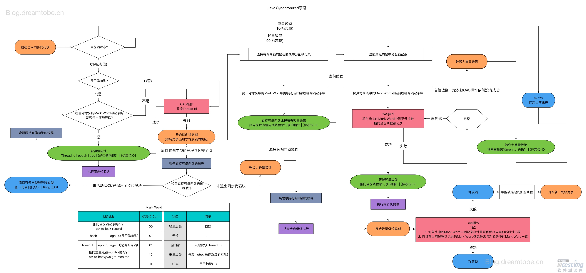

# JAVA内存模型

相关博客:<https://www.codetd.com/article/8273372>

## 常用命令

```shell
#观察虚拟机配置,打印version时自带的命令行参数
java -XX:+PrintCommandLineFlags -version
#表示指针压缩打开
-XX:+UseCompressedClassPointers

C:\Windows\system32>java -XX:+PrintCommandLineFlags -version
-XX:InitialHeapSize=132302464 -XX:MaxHeapSize=2116839424 -XX:+PrintCommandLineFlags -XX:+UseCompressedClassPointers -XX:+UseCompressedOops -XX:-UseLargePagesIndividualAllocation -XX:+UseParallelGC
java version "1.8.0_191"
Java(TM) SE Runtime Environment (build 1.8.0_191-b12)
Java HotSpot(TM) 64-Bit Server VM (build 25.191-b12, mixed mode)

#+加号改成"-"表示不进行压缩
#class指针压缩
-XX:+UseCompressedClassPointers 
#引用类型指针压缩
-XX:+UseCompressedOops

-XX:+DoEscapeAnalysis  #开启逃逸分析；
-XX:+EliminateLocks    #开启同步消除；
-XX:+EliminateAllocations#开启标量替换；
```

## 问题列表

### 计算对象占用空间大小

Object obj = new Object();占内存大小

obj 是一个指向对象引用占内存8字节(64位系统)+

```xml
<!-- 如果使用 Maven 打包的话， 可以直接在 pom.xml 里面设置 MANIFEST.MF 的参数 ：-->
<!-- pom打jar包的时候设置MANIFEST.MF的key/value，可以通过在pom.xml文件中添加plugin的方式来实现 -->
    <build>
        <plugins>
            <plugin>
                <artifactId>maven-jar-plugin</artifactId>
                <version>2.4</version>
                <configuration>
                    <finalName>SizeOfAgent</finalName>
                    <archive>
                        <manifestEntries>
                            <Premain-class>com.wenniuwuren.objectsizeof.SizeOfAgent</Premain-class>
                            <Boot-Class-Path></Boot-Class-Path>
                            <Can-Redefine-Classes>false</Can-Redefine-Classes>
                        </manifestEntries>
                        <addMavenDescriptor>false</addMavenDescriptor>
                    </archive>
                </configuration>
            </plugin>
        </plugins>
    </build>
```


### 为什么GC年龄默认为15(最大为15)

> **因为Object Header采用4个bit位来保存年龄，4个bit位能表示的最大数就是15！**
>
> 手动触发一次GC,就会使年龄加1岁
>
> 不是必须到达15岁才会晋升为老年代，JVM采用动态年龄计算，以防止老年代内存过于宽裕，而新生代内存被撑爆。

```xml
<!-- OpenJDK提供了一个工具包，可以输出对象的结构布局信息。 -->
<dependency>
    <groupId>org.openjdk.jol</groupId>
    <artifactId>jol-core</artifactId>
    <version>0.9</version>
</dependency>
```

```java
/**
 * @Author: pch
 * @Date: 2019/12/23 09:08
 * @Description: 查看对象的头信息
 */
public class HeaderTest {
	public static void main(String[] args) throws InterruptedException {
		Person p = new Person();
		//不调用hashCode() 不会记录哈希码
		int hashCode = p.hashCode();
		//转16进制输出，与头信息中HashCode进行比较
		String hex = Integer.toHexString(hashCode);
		System.out.println("HashCode十六进制:"+hex);
        //每一次gc年龄加1
        System.gc();
		print(p);
	}

	static void print(Person p){
		System.err.println(ClassLayout.parseInstance(p).toPrintable());
	}
}
class Person{
	private boolean flag;
}
```


## Java对象和内存布局


### 对象内存大小

>对象分普通对象和数组对象
>
>指针分普通类型指针[ClassPointer]和引用类型指针[Oops]
>
>数组对象比普通对象多个数组长度4字节.

#### 普通对象

1. 对象头：markword  8
2. ClassPointer指针：-XX:+UseCompressedClassPointers 表示压缩指针打开为4字节 不开启为8字节
3. 实例数据
   1. 引用类型：-XX:+UseCompressedOops 为4字节 不开启为8字节 ,比如String 为引用类型,引用另一个对象
      **Oops**：Ordinary Object Pointers
4. Padding对齐，8的倍数

| Primitive Type | Memory Required(bytes) |
| -------------- | ---------------------- |
| byte, boolean  | 1                      |
| short, char    | 2                      |
| int, float     | 4                      |
| long, double   | 8                      |

#### 数组对象

1. 对象头：markword 8
2. ClassPointer指针同上
3. 数组长度：4字节
4. 数组数据
5. 对齐 8的倍数

```java
//去取对应包装类的class，JVM会自动封装成包装类。输出为true
System.out.print(int.class=Integer.TYPE)
```


### 内存布局


#### 对象头

在 32 位的 HotSpot 虚拟机中，如果对象处于未被锁定的状态下，那么 Mark Word 的 32bit 空间中的 25bit 用于存储对象哈希码，4bit 用于存储对象分代年龄，2bit 用于存储锁标志位，1bit 固定为 0，如下表所示：


在 32 位系统下，存放 Class 指针的空间大小是 4 字节，Mark Word 空间大小也是4字节，因此头部就是 8 字节，如果是数组就需要再加 4 字节表示数组的长度，如下表所示：


在 64 位系统及 64 位 JVM 下，开启指针压缩，那么头部存放 Class 指针的空间大小还是4字节，而 Mark Word 区域会变大，变成 8 字节，也就是头部最少为 12 字节，如下表所示：


> 压缩指针：开启指针压缩使用算法开销带来内存节约，Java 对象都是以 8 字节对齐的，也就是以 8 字节为内存访问的基本单元，那么在地理处理上，就有 3 个位是空闲的，这 3 个位可以用来虚拟，利用 32 位的地址指针原本最多只能寻址 4GB，但是加上 3 个位的 8 种内部运算，就可以变化出 32GB 的寻址。


> 32位/64位虚拟机,一个字宽分别为32/64bit,其对象头的内容如下:

| 长度(32位/64位虚拟机) | 内容                   | 说明                         |
| --------------------- | ---------------------- | ---------------------------- |
| 32/64bit              | Mark Word              | 存储对象的hashCode或锁信息等 |
| 32/64bit              | Class Metadata Address | 存储到对象类型数据的指针     |
| 32/64bit              | Array length           | 数组的长度（如果是数组）     |

> Mark Word的结构(无锁状态):

32位:

| 25 bit   | 4 bit        | 1 bit        | 2 bit    |
| -------- | ------------ | ------------ | -------- |
| hashCode | 对象分代年龄 | 是否是偏向锁 | 锁标志位 |

63位:

| 25 bit | 31 bit   | 1 bit    | 4 bit        | 1 bit        | 2 bit    |
| ------ | -------- | -------- | ------------ | ------------ | -------- |
| 未使用 | hashCode | cms_free | 对象分代年龄 | 是否是偏向锁 | 锁标志位 |


hashCode

1. 重写:根据系统和内存布局计算出hashCode

2. 没重写默认调用了System.identityHashCode(),根据内存地址来产生hash值,是未被覆写的 java.lang.Object.hashCode() 或者 java.lang.System.identityHashCode(Object) 所返回的值

> 当一个对象在无锁状态时已经对计算过identity HashCode ,它就会无法进入偏向锁状态
>
> 当一个对象当前正处于偏向锁状态,并且需要计算其identity hash code的话,则它的偏向锁会被撤销,并且锁会膨胀为重量级锁
>
> 重量锁的实现中，ObjectMonitor类里有字段可以记录非加锁状态下的mark word，其中可以存储identity hash code的值。或者简单说就是重量锁可以存下identity hash code。



##### 锁

相关博客:

<https://www.cnblogs.com/dugk/p/8900856.html>

<https://zhuanlan.zhihu.com/p/40729293>

<http://ifeve.com/java_lock_see2/>

<https://github.com/farmerjohngit/myblog/issues/12>

<https://cloud.tencent.com/developer/article/1036756>

> Java中每个对象都可作为锁，锁有四种级别，按照量级从轻到重分为：无锁、偏向锁、轻量级锁、重量级锁。每个对象一开始都是无锁的，随着线程间争夺锁，越激烈，锁的级别越高，并且<font color=red>锁只能升级不能降级</font>。
>
> 重量级锁不使用自旋，获取锁失败的线程直接进入阻塞状态
> 轻量级锁使用自旋
>
> 轻量级锁和重量级锁都会在线程的栈中创建一个专门的空间**Displaced Mark Word**，用于在获取锁的时候，复制“锁”的对象头里面的**Mark Word**，把当前的线程ID写进**Mark Word**；而在获取锁的时候,再从Displaced Mark Word复制回锁的Mark Word里面。


* 无锁：锁标志位为“01”状态，是否为偏向锁为“0”

* 偏向锁：只有一个线程进入临界区
* 轻量级锁：多个线程交替进入临界区
* 重量级锁：多个线程同时进入临界区


###### 锁的优缺点比较

| 锁       | 优点                                                         | 缺点                                                 | 适用场景                         | 是否偏向锁 | 锁标志位 |
| -------- | ------------------------------------------------------------ | ---------------------------------------------------- | -------------------------------- | ---------- | -------- |
| 无锁     |                                                              |                                                      |                                  | 0          | 01       |
| 偏向锁   | 加锁和解锁不需要额外的消耗，和执行非同步方法比仅存在纳秒级的差距 | 如果线程间存在锁竞争，会带来额外的锁撤销的消耗       | 适用于只有一个线程访问同步块场景 |            | 01       |
| 轻量级锁 | 竞争的线程不会阻塞，提高了程序的响应速度                     | 如果始终得不到锁竞争的线程使用自旋会消耗CPU          | 追求响应时间,锁占用时间很短      |            | 00       |
| 重量级锁 | 线程竞争不使用自旋，不会消耗CPU                              | 线程阻塞，响应时间缓慢                               | 追求吞吐量,锁占用时间较长        |            | 10       |
| 自旋锁   | 一直处于用户态,不会使线程状态发生切换(一直是active)          | 自旋锁是不公平的,等待获取锁的线程进入循环等待消耗CPU | 追求响应时间,锁占用时间很短      |            |          |

自旋锁:通过CAS算法[compare and swap（比较与交换）]实现的乐观锁,是非阻塞同步锁(也就是无锁,是一种思想,通过版本号或者)


###### 【锁优化】逃逸分析和同步消除和标量替换

> **参数开启**
>
> - `-XX:+DoEscapeAnalysis`开启逃逸分析；
> - `-XX:+EliminateLocks`开启同步消除；
> - `-XX:+EliminateAllocations`开启标量替换；


> 一)、逃逸分析：逃逸分析的基本行为就是分析对象动态作用域

- 方法逃逸:当一个对象在方法中定义后,可能作为调用参数被外部方法所引用。

- 线程逃逸:通过复制赋值给类变量或者可以在其他线程中访问到的实例变量。


> 二)、同步消除: Java虚拟机在JIT期间通过逃逸分析(运行上下文的扫描)发现对象是非逃逸的(内部同步代码未逃逸到外部)，编译器可以自行消除同步(多余的锁同步),就可以进行同步消除操作。


①**栈上分配stack allocation**：就是把方法中的变量和对象分配到栈上，方法执行完后自动销毁，而不需要垃圾回收的介入，从而提高系统性能。

【注】Java没有实现真正意义上的栈上分配，而是通过标量替换来实现栈上分配。

②**同步消除synchronization Elimination**：那些不会在其他线程访问到的变量就可以消除相对应的同步措施(同步块取消掉)。

> **同步消除:锁消除Lock Elision、锁粗化Lock Coarsening**
>
> * 锁消除：虚拟机的运行时编译器在运行时如果检测到一些要求同步的代码上不可能发生共享数据竞争，则会去掉这些锁。
>
> * 锁粗化：将临近的代码块用同一个锁合并起来。


③**标量替换**：如果通过逃逸分析证明了一个对象不会被外部访问，并且此对象【聚合量】可以被拆散，则程序执行时可能不会创建此对象，而是改为直接创建若干个被这个方法使用到的成员变量【标量：不能进一步分解的原始数据类型（int，long等数值类型以及reference类型等）】来代替。拆散后的变量可被单独分析与优化，可以各自分别在栈帧或者寄存器中分配空间，原本的对象就无需整体分配空间。


#### 实例数据

> 实例数据部分是对象真正存储的有效信息，也是在程序代码中所定义的各种类型的字段内容。无论是从父类继承下来的，还是在子类中定义的，都需要记录起来。


#### 对齐填充


### 对象定位

> * 对象实例数据（堆）:对象中各个实例字段的数据[]
> * 对象类型数据（方法区）：对象的类型、父类、实现的接口、方法等[class对象]
> * 静态区（也在方法区中）用来存放静态变量，静态块

#### 句柄池

> 在Java堆中会划分出一块内存来作为句柄池,reference中存储的就是对象的**稳定的句柄池地址**,而句柄池中包含了对象实例数据与类型数据各自的具体地址信息；
>
> 在对象被移动(垃圾收集时移动对象是非常普遍的行为)时只会改变句柄池中的实例数据指针,而reference本身不需要修改。GC三色标记的时候移动对象


#### 直接指针

> reference对象直接存储对象地址,速度快，节省了一次指针定位的时间开销。HotSpot采用此方式


### 对象的分配过程


### 对象的创建


## 运行时数据区域

> 线程私有：PC -> VMS/NMS 
>
> 线程共享：Java堆、方法区
>
>


### 程序计数器(PC Register)

> 程序计数器是一块较小的线程私有的内存空间,可以看作是当前线程所执行的字节码的行号指示器。一个处理器都只会执行一条线程中的指令。因此，为了线程切换后能恢复到正常的执行位置，每条线程都需要有一个独立的PC程序计数器使之各个线程之间计算器互不影响，独立存储，称这类内存区域为“线程私有”内存。

### Java虚拟机栈(VMS)

> 虚拟机栈是线程私有的,也就是每个线程独有一个虚拟机栈，虚拟机栈的生命周期与线程的相同。一个虚拟机栈中包含了各个线程所
>
> 虚拟机栈的描述也就是Java方法执行的内存模型：每个方法在创建的时候同时会创建一个栈帧来存储局部变量表、操作数栈、动态链接、方法出口等信息。每个方法从调用到直至执行完成的过程，就对应着一个栈帧在虚拟机栈中入栈到出栈的过程。
>
> 运行程序的方法和线程

* 动态链接：
* 局部变量表：

> 非static方法时,在局部变量表中第0位会出现隐藏默认含有的this，然后再接着是局部变量

### 本地方法栈(NMS)


### 方法区

> Perm Space(<1.8)：字符串常量位于PermSpace，FGC不会清理,大小启动的时候指定，启动后不能改变其大小。
>
> Meta Space(>=1.8)：字符串常量不放在方法区中改成了放在堆中，会触发FGC清理,不设定大小，最大就是物理内存。


### 堆

> 存放实例对象


## 指令集

### 基于栈的指令集


### 基于寄存器的指令集

> Hotspot的local variable table类似于寄存器

